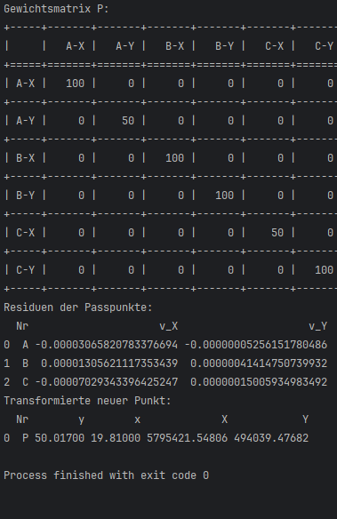
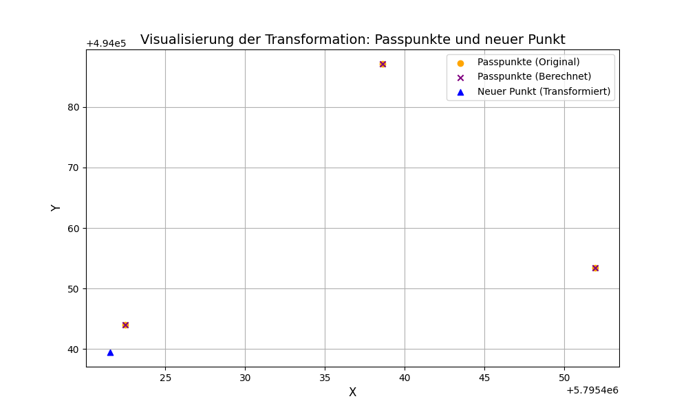

# Aufgabe 16
>Bearbeitet von:  
> Arvo Klöck  | 909003

## Code
```python
import numpy as np
import pandas as pd
from scipy.optimize import least_squares
import matplotlib.pyplot as plt
from tabulate import tabulate


def create_dataframes():
    """
    Creates dataframes for identical points and new points.

    Returns:
        tuple: DataFrames for identical points (ident_df) and new points (neu_df).
    """
    identische_punkte = {
        "Nr": ['A', 'B', 'C'],
        "y": [0.312, 45.652, 22.572],
        "x": [29.342, 21.282, 0.762],
        "Y": [494087.123, 494043.984, 494053.418],
        "X": [5795438.615, 5795422.500, 5795451.911],
        "sY": [0.010, 0.020, 0.010],
        "sX": [0.010, 0.020, 0.010],
    }

    neue_punkte = {
        "Nr": ['P'],
        "y": [50.017],
        "x": [19.810],
    }

    ident_df = pd.DataFrame(identische_punkte)
    neu_df = pd.DataFrame(neue_punkte)
    return ident_df, neu_df

def residuals(params, y, x, Y, X, P):
    """
    Calculates the residuals for the transformation, weighted by the weight matrix P.

    Args:
        params (array): Transformation parameters.
        y (array): y-coordinates of identical points.
        x (array): x-coordinates of identical points.
        Y (array): Y-coordinates of identical points.
        X (array): X-coordinates of identical points.
        P (array): Weight matrix.

    Returns:
        array: Weighted residuals for the transformation.
    """
    a1, a2, a3, b1, b2, b3 = params
    X_calc = a1 * y + a2 * x + a3
    Y_calc = b1 * y + b2 * x + b3
    residuals = np.hstack(((X_calc - X), (Y_calc - Y)))
    return P @ residuals

def transform_points(y, x, params):
    """
    Transforms the given points based on the parameters.

    Args:
        y (array): y-coordinates of points.
        x (array): x-coordinates of points.
        params (array): Transformation parameters.

    Returns:
        tuple: Transformed X and Y coordinates.
    """
    a1, a2, a3, b1, b2, b3 = params
    X_trans = a1 * y + a2 * x + a3
    Y_trans = b1 * y + b2 * x + b3
    return X_trans, Y_trans

def perform_least_squares(y_vals, x_vals, Y_vals, X_vals, P):
    """
    Performs least squares adjustment to find the best transformation parameters.

    Args:
        y_vals (array): y-coordinates of identical points.
        x_vals (array): x-coordinates of identical points.
        Y_vals (array): Y-coordinates of identical points.
        X_vals (array): X-coordinates of identical points.
        P (array): Weight matrix.

    Returns:
        array: Best transformation parameters.
    """
    initial_params = np.zeros(6)
    result = least_squares(residuals, initial_params, args=(y_vals, x_vals, Y_vals, X_vals, P), method='lm')
    return result.x

def calculate_residuals(ident_df, params):
    """
    Calculates the residuals for the identical points and adds them to the DataFrame.

    Args:
        ident_df (DataFrame): DataFrame of identical points.
        params (array): Transformation parameters.

    Returns:
        DataFrame: Updated DataFrame with calculated residuals.
    """
    ident_df["X_calc"], ident_df["Y_calc"] = transform_points(ident_df["y"], ident_df["x"], params)
    ident_df["v_X"] = ident_df["X"] - ident_df["X_calc"]
    ident_df["v_Y"] = ident_df["Y"] - ident_df["Y_calc"]
    return ident_df

def transform_new_points(neu_df, params):
    """
    Transforms the new points based on the calculated parameters.

    Args:
        neu_df (DataFrame): DataFrame of new points.
        params (array): Transformation parameters.

    Returns:
        DataFrame: Updated DataFrame with transformed new points.
    """
    neu_df["X"], neu_df["Y"] = transform_points(neu_df["y"], neu_df["x"], params)
    return neu_df

def plot_transformation(ident_df, neu_df):
    """
    Plots the transformation of identical and new points.

    Args:
        ident_df (DataFrame): DataFrame of identical points.
        neu_df (DataFrame): DataFrame of new points.
    """
    plt.figure(figsize=(10, 6))
    scatter_original = plt.scatter(ident_df["X"], ident_df["Y"], color="orange", label="Passpunkte (Original)", marker="o")
    scatter_calculated = plt.scatter(ident_df["X_calc"], ident_df["Y_calc"], color="purple", label="Passpunkte (Berechnet)", marker="x")
    scatter_new = plt.scatter(neu_df["X"], neu_df["Y"], color="blue", label="Neuer Punkt (Transformiert)", marker="^")

    for i in range(len(ident_df)):
        plt.plot([ident_df["X"].iloc[i], ident_df["X_calc"].iloc[i]],
                 [ident_df["Y"].iloc[i], ident_df["Y_calc"].iloc[i]],
                 linestyle="--", color="gray")

    plt.xlabel("X", fontsize=12)
    plt.ylabel("Y", fontsize=12)
    plt.title("Visualisierung der Transformation: Passpunkte und neuer Punkt", fontsize=14)
    plt.legend(handles=[scatter_original, scatter_calculated, scatter_new], loc="best")
    plt.grid()
    plt.show()

def print_weight_matrix(P, ident_df):
    """
    Prints the weight matrix P in the console in a tabular format.

    Args:
        P (array): The weight matrix.
        ident_df (DataFrame): DataFrame of identical points (for labeling).
    """
    num_points = len(ident_df)
    labels = []
    for i in range(num_points):
        labels.append(f"{ident_df['Nr'].iloc[i]}-X")
        labels.append(f"{ident_df['Nr'].iloc[i]}-Y")

    # Convert the weight matrix to a list of lists for tabulate
    P_list = P.tolist()
    table = tabulate(P_list, headers=labels, showindex=labels, tablefmt="grid")
    print(table)

def plot_regression_line(ident_df, params):
    y_vals = np.linspace(min(ident_df["y"]), max(ident_df["y"]), 100)
    x_vals = np.linspace(min(ident_df["x"]), max(ident_df["x"]), 100)
    X_trans, Y_trans = transform_points(y_vals, x_vals, params)

    plt.figure(figsize=(10, 6))
    plt.plot(X_trans, Y_trans, color="red", label="Regressionsgerade")
    plt.scatter(ident_df["X"], ident_df["Y"], color="orange", label="Passpunkte (Original)", marker="o")
    plt.scatter(ident_df["X_calc"], ident_df["Y_calc"], color="purple", label="Passpunkte (Berechnet)", marker="x")
    plt.xlabel("X", fontsize=12)
    plt.ylabel("Y", fontsize=12)
    plt.title("Regressionsgerade und Passpunkte", fontsize=14)
    plt.legend(loc="best")
    plt.grid()
    plt.show()


def main():
    ident_df, neu_df = create_dataframes()
    y_vals = ident_df["y"].values
    x_vals = ident_df["x"].values
    Y_vals = ident_df["Y"].values
    X_vals = ident_df["X"].values

    sX = ident_df["sX"].values
    sY = ident_df["sY"].values
    weights = 1 / np.hstack((sX, sY))
    P = np.diag(weights)
    print('Gewichtsmatrix P:')
    print_weight_matrix(P, ident_df)

    params = perform_least_squares(y_vals, x_vals, Y_vals, X_vals, P)
    ident_df = calculate_residuals(ident_df, params)
    neu_df = transform_new_points(neu_df, params)

    print("Residuen der Passpunkte:")
    print(ident_df[["Nr", "v_X", "v_Y"]].to_string(float_format="{:.20f}".format))

    plot_transformation(ident_df, neu_df)
    plot_regression_line(ident_df, params)

    print("Transformierte neuer Punkt:")
    print(neu_df.to_string(float_format="{:.5f}".format))


if __name__ == "__main__":
    main()
```


## Output


